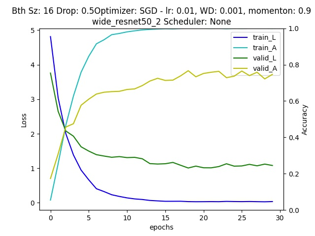

# Homework1 - Classification

You can see report [here](report/report.md) in markdown format, or [pdf](report/VRDL_HW1_309553018_Report.pdf) format which is exported by [Typora](https://typora.io/).

Competetion: https://competitions.codalab.org/competitions/35668

Result Accuracy on testing dataset: 0.72272  



- [Homework1 - Classification](#homework1---classification)
  - [Environment](#environment)
  - [Code](#code)
  - [Dataset](#dataset)
  - [Model](#model)
  - [Train or Test](#train-or-test)

## Environment
Install CUDA, cuDNN, PyTorch  
modules:
```python=
pip install numpy matplotlib tqdm scikit-learn
pip install PyQt5  # (Optional) Ubuntu only
sudo apt-get install libxcb-xinerama0  # (Optional) If
    ERROR: Could not load the Qt platform plugin "xcb" in "" even though it was found.
    happend.
```

## Code
Download whole code with the following command:
`$ git clone https://github.com/clashroyaleisgood/Course_VRDL.git`

## Dataset
Get data from this [competetion](https://competitions.codalab.org/competitions/35668?secret_key=09789b13-35ec-4928-ac0f-6c86631dda07)
- Train Data  
  Put Training data to `HW 1 classification/training_images/`
- Test Data  
  Put Testing data to `HW 1 classification/testing_images/`

## Model
Get model and weight with this [link](https://drive.google.com/file/d/1rvYFyPD9iu1JcOeVKefbxNeNqWy5FGSu/view?usp=sharing)  
Put model file to `HW 1 classification/MODEL.pt`

---
Place these files like

```
HW 1 classification/
        ├─ HW 1.py
        ├─ HW 1 Predict.py
        ├─ inference.py  # same to HW 1 Predict.py
        ├─ MODEL.pt                       <------- Here
        └─ submission_readme/
                └─ ...
        └─ 2021VRDL_HW1_datasets/
                ├─ classes.txt
                ├─ testing_img_order.txt
                ├─ training_labels.txt
                └─ training_images/       <------- Here
                        │─ 0003.jpg
                │       │─ 0008.jpg
                │       └─ ...
                └─ testing_images/        <------- Here
                        │─ 0001.jpg
                        └─ ...
```
by: https://zh.wikipedia.org/wiki/%E6%96%B9%E6%A1%86%E7%BB%98%E5%88%B6%E5%AD%97%E7%AC%A6

## Train or Test
- Train  
  `$ python HW 1 classification/HW 1.py`
- Test  
  `$ python HW 1 classification/inference.py`
