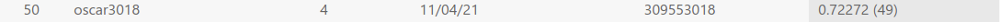
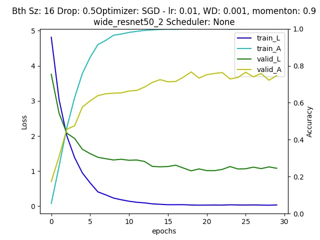

# HW 1
Oscar Lin 309553018  
Project repository: https://github.com/clashroyaleisgood/Course_VRDL/tree/main/HW%201%20classification

Competition: https://competitions.codalab.org/competitions/35668?secret_key=09789b13-35ec-4928-ac0f-6c86631dda07

___
## Table of Contents
- [HW 1](#hw-1)
  - [Table of Contents](#table-of-contents)
  - [Introduction](#introduction)
  - [Data Pre-Processing](#data-pre-processing)
  - [Model architecture](#model-architecture)
  - [Hyperparameters](#hyperparameters)
  - [Deal with overfitting](#deal-with-overfitting)
  - [Summary](#summary)

<div style="page-break-after: always;"></div>

## Introduction
This challenge is a birds species images classification task with **200 classes**. The large amount of classes is the first difficulty.  
The second difficulty is size of training is only **3000 images**, so I should let the model recognized a certain bird species from 200 species in about only 15 images.  
This reduce the **generalization** of bird characteristics in one species. The model would get **overfitting** eazily.

<div style="page-break-after: always;"></div>

## Data Pre-Processing
The original image are with different sizes, so I should transform these images to a certain size to train my model.  
Here I use some different transforms that combine together.

```python=
preprocess = transforms.Compose([
    transforms.ToTensor(),
    transforms.RandomRotation(10),
    transforms.Pad(100),
    transforms.CenterCrop((400, 400)),
    transforms.RandomHorizontalFlip(p=0.5)
])
```
| Origin | Rand Rotate | Pad + Crop | Rand Flip |
| ------ | ----------- | ---------- | --------- |
| X | Random Rotate (-10, 10) degrees | Crop the image to (400, 400) after Padding 100 | Random Flip with 50% chance |
|||||

1. RandomRotation(10)  
   Birds picture are taken with different angles, so I rotate the image randomly with 10 degrees to generalize the model to fit many different angles.
2. transforms.Pad(100) + transforms.CenterCrop((400, 400))  
   The main purpose of this transformation is to focus on center region of large images, preventing from getting too much background information.  
   Padding is used to enlarge small size image, avoid to crop a 400x400 region with 200x200 images.
3. RandomHorizontalFlip(p=0.5)  
   The reason to do this transformation is also similar to (1.), it's common to take picture of birds in the left or right side. So I do this augmentation for generalization.

- Try AutoAugment(), RandAugment()  
  I had also try these two transformation provided with prtorch that looks very cool and powerful. It seems to improve the accuracy of image classification models. But I get a even worse result using AutoAugment or RandAugment. I guess it is because of extreme color modified.
  
  <!--  -->
  
- Use Crop() instead of Resize()
  There are large amounts of aspect ratio in the image data, so I think that would be bad if I use Resize to certain size directly. That will change the aspect ratio, let the birds get longer or shorter, and **destory** an important feature to classify birds.

<div style="page-break-after: always;"></div>

## Model architecture
I use pretrained model in Pytorch official website.  
Firstly I use **ResNet-152** as my pretrained model, freeze most of the layers only train the final few layer and the "layer4". Obciously I get a very high accuracy on training data, but getting really bad on validation data. Then I realized that: a 152-layer model is too deep that will get overfitting very easily, especially on this small dataset.  
<!--  -->
 

So I change my model architecture to ResNet-50 and Wide ResNet-50-2, which are smaller models that will be helful to overfitting proplem.

Wide ResNet simply increase number of channels compared to ResNet. Otherwise the architecture is the same.

<div style="page-break-after: always;"></div>

## Hyperparameters

```python=
BatchSize = 16
EpochCounts = 30
NumWorkers = 4

LearningRate = 0.01
WeightDecay = 0.001  # L2 loss

OptimizerType = lambda params: optim.SGD(params, lr=LearningRate, weight_decay=WeightDecay, momentum=0.9)

PaddingWidth = 100
CropSize = (400, 400)

DropoutRate = 0.5  # Last FC layer dropout
```

<div style="page-break-after: always;"></div>

## Deal with overfitting

- Data augmentation
- Model with fewer layers
- Weight decay, model regularization  
  **Experiments to find best weight decay**: 0.001  
  | 0.01 | 0.005 | 0.001 |
  | ---- | ----- | ----- |
  ||||
  
  | 0.0005 | 0.0001 |
  | ------ | ------ |
  |||
- Validation data  
  Save model weight every epoch **if loss on validation data get lower than previous epoch**.  
  Simillar to early stopping

<div style="page-break-after: always;"></div>

## Summary

In this chalenge, I use Wide-ResNet and the pre-trained weight from PyTorch, and finally get accuracy: 0.72272 on testing data provided by the competetion.

<!--  -->


I try many ways to tackle with overfitting, which is the biggest challenge to this competetion, such as data augmentation, smaller model, etc.  
Detailed in section [Deal with overfitting](#deal-with-overfitting)

Most spetially, I try my best to keep the training structure clean and easy to modify.  Split each region using comment dash lines and move all hyperparameters to top of the code such that I could do my experiment/training eazily.

Though final result is not that prefect, but I think I find a way to keep my training code clean which will helps me from messing up the train with horrible code. And this must be helpful to other challenges later.
