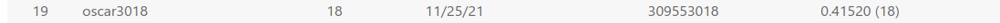

# Homework2 - Object Detection

You can see report [here](report/report.md) in markdown format, or [pdf](report/VRDL_HW2_309553018_Report.pdf) format which is exported by [Typora](https://typora.io/).

Competetion: https://competitions.codalab.org/competitions/35668

Result mAP:0.5:0.95 on testing dataset: **0.41520**  
Result inference speed on testing dataset: **0.0948s** per image  
[Details](#result)

with help of [yolov5 model](https://github.com/ultralytics/yolov5)

Colab inference: [code](https://drive.google.com/file/d/1RQaeVJLyXpskW6_QK5nggbJp1K8tGBL5/view?usp=sharing)  
Model weight: [Model.pt](https://drive.google.com/file/d/1mqJ-FLRz-bnXSM4SvPR_blfZuwDD-qPA/view?usp=sharing)

## Table of Contents
- [Homework2 - Object Detection](#homework2---object-detection)
  - [Table of Contents](#table-of-contents)
  - [Environment](#environment)
  - [Code](#code)
  - [Dataset](#dataset)
    - [Preprocessing(Optional)](#preprocessingoptional)
  - [Model](#model)
  - [Architecture](#architecture)
  - [Train or Test](#train-or-test)
    - [Testing](#testing)
    - [Training](#training)
  - [Result](#result)

## Environment
Install CUDA, cuDNN, PyTorch  
modules:
```python=
pip install numpy h5py opencv-python
pip install pandas requests tensorboard seaborn PyYAML
```
or simply
```
pip install -r Course_VRDL/HW2_Object_Detection/requirements.txt
```
## Code
Download code with the following command:  
`$ git clone https://github.com/clashroyaleisgood/Course_VRDL.git`  
Then Download yolov5 with the following command:  
`$ git clone https://github.com/ultralytics/yolov5`

**Notice that**: these two repository should be placed under the same directory
```
director/
    ├── Course_VRDL/
    │   └── ...
    └── yolov5/
        └── ...
```

## Dataset
Get data from this [competetion](https://competitions.codalab.org/competitions/35888?secret_key=7e3231e6-358b-4f06-a528-0e3c8f9e328e)
, [Dataset Link](https://drive.google.com/drive/folders/1aRWnNvirWHXXXpPPfcWlHQuzGJdXagoc?usp=sharing)

- Train Data  
  Put Training data to `HW2_Object_Detection/HW2_dataset/train_images/`
  
- Test Data  
  Put Testing data to `HW2_Object_Detection/HW2_dataset/test_images/`

### Preprocessing(Optional)
If you just want to use this model to detect the numbers, not need to train the model yourself, you can skip this step.

split training data and validation data from `train_images/` by 4 train : 1 valid

`~/Course_VRDL$ python HW2_Object_Detection/parse_label.py`
> get original labels from `train_images/digitStruct.mat`  
> get original pictures from `train_images/`  
> generate labels and move pictures like...  
> `Course_VRDL/images/garbage/imgs.pngs` are pictures that bounding box getting out of range of the image
```
Course_VRDL/
    ├── images/
    │   ├── train/
    │   │   ├── 1.png
    │   │   └── 2.png...
    │   ├── valid/
    │   └── garbage/
    │
    └── labels/
        ├── train/
        │   ├── 1.txt
        │   └── 2.txt...
        └── valid/
```

with help of [this site](https://www.vitaarca.net/post/tech/access_svhn_data_in_python/)

## Model
Get model and weight with this [link](https://drive.google.com/file/d/1mqJ-FLRz-bnXSM4SvPR_blfZuwDD-qPA/view?usp=sharing)  
Put model file to `Course_VRDL/HW2_Object_Detection/MODEL.pt`

## Architecture
```
director/
    ├── yolov5/
    └── Course_VRDL/
        ├── parse_label.py
        ├── parse_predict_result.py
        ├── MODEL.pt
        │
        ├── images/
        │   ├── train/
        │   │   ├── 1.png
        │   │   └── 2.png...
        │   ├── valid/
        │   └── garbage/
        │
        ├── labels/
        │   ├── train/
        │   │   ├── 1.txt
        │   │   └── 2.txt...
        │   └── valid/
        │
        ├── test_images/
        └── train_images/
```

## Train or Test
### Testing
1. Inference: detect images in test_images/ with pretrained weights
```
~/yolov5$ python detect.py \
                --weights ../Course_VRDL/HW2_Object_Detection/MODEL.pt \
                --source ../Course_VRDL/HW2_Object_Detection/HW2_dataset/test_images \
                --img 320 \
                --conf-thres 0.01 \
                --save-txt \
                --save-conf
```
detect result will be stored in `yolov5/runs/detect/exp?/labels`
> **Notice that** `exp?` depend on how many times you do the detection(exp -> exp2 -> exp3...)  
> after detection, yolov5 will tell you which `exp?` is the result saved to

2. Result Parsing: Parse result from yolov5 output format to COCO dataset format(in json)

change the line 6 of parse_predict_result.py, the exp is depend on the previous step.  
`ResultPath = r'../yolov5/runs/detect/exp/labels'`

atfer correcting the exp?, you can exectute the following command to get the result  
`~/Course_VRDL$ python HW2_Object_Detection/parse_predict_result.py`

the result is sotored in `HW2_Object_Detection/answer.json`  
you can also change to which director you want in line 8 of `parse_predict_result.py`  
`DumpJsonPath = r'HW2_Object_Detection/answer.json'`

### Training
1. Data preprocessing [mentioned before](#preprocessingoptional)
2. Training: go to yolov5 folder and execute  
```
~/yolov5$ python train.py \
            --img 320 \
            --batch 64 \
            --epochs 100 \
            --data ../Course_VRDL/HW2_Object_Detection/HW2_dataset/dataset.yaml \
            --weights yolov5m.pt

# if you don't have enough memory, just reduce the batchsize
```
> the result will be stored in `yolov5/runs/train/exp?/`  
> the weights we use is stored in `yolov5/runs/train/exp?/weights/best.pt`  
> **Notice that** `exp?` depend on how many times you do the training(exp -> exp2 -> exp3...)  
> after training, yolov5 will tell you which `exp?` is the result saved to
3. Inference: go to yolov5 folder and execute  
```
~/yolov5$ python detect.py \
            --weights runs/train/{exp?}/weights/best.pt \
            --source ../Course_VRDL/HW2_Object_Detection/HW2_dataset/test_images \
            --img 320 \
            --conf-thres 0.01 \
            --save-txt \
            --save-conf
```
The next step is the same as [Testing](#testing) region

## Result
mAP:0.5:0.95 on testing dataset: **0.41520 ** 


inference speed on testing dataset: **0.0948**
  