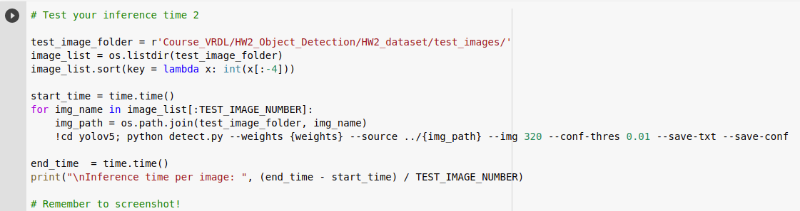
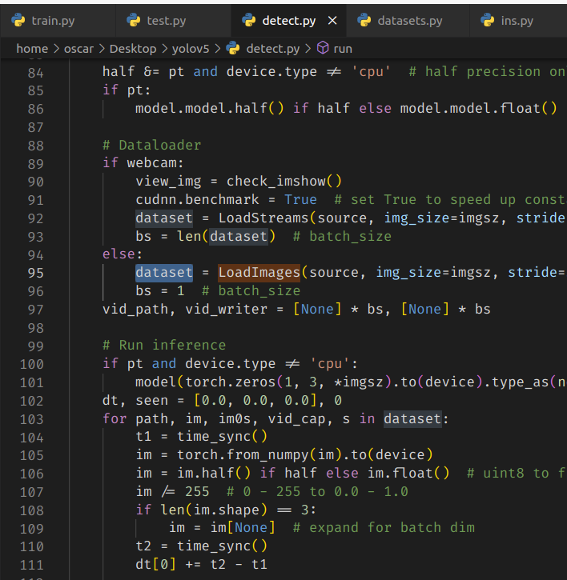
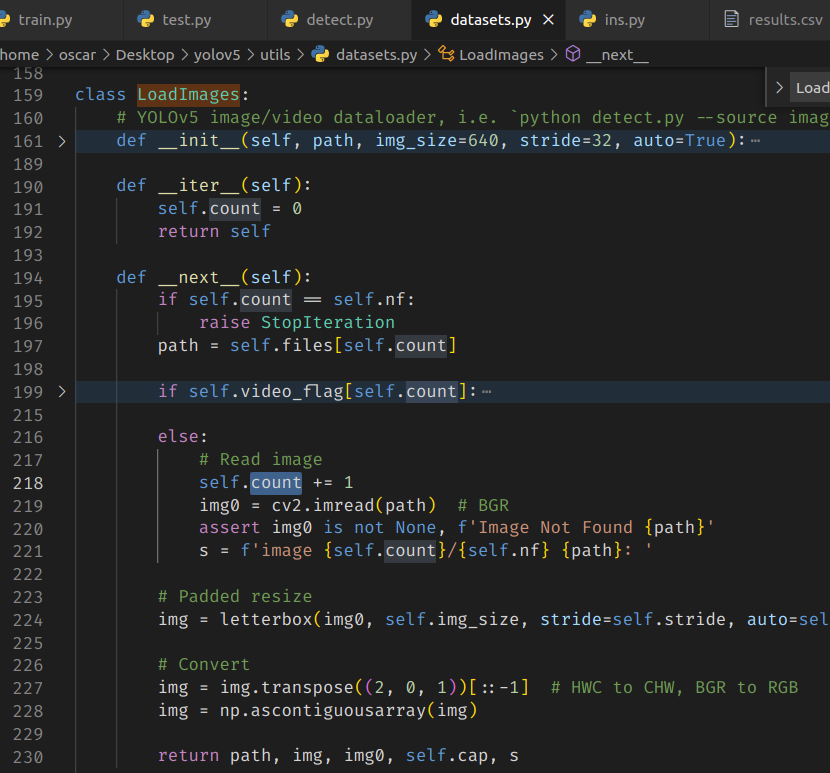

# HW 2
Oscar Lin 309553018  
Project repository: https://github.com/clashroyaleisgood/Course_VRDL/tree/main/HW2_Object_Detection

Competition: https://competitions.codalab.org/competitions/35888?secret_key=7e3231e6-358b-4f06-a528-0e3c8f9e328e

Colab Inference: https://drive.google.com/file/d/1RQaeVJLyXpskW6_QK5nggbJp1K8tGBL5/view?usp=sharing

___
## Table of Contents

- [HW 2](#hw-2)
  - [Table of Contents](#table-of-contents)
  - [Introduction](#introduction)
    - [Result](#result)
  - [Data Pre-Processing](#data-pre-processing)
  - [Model architecture](#model-architecture)
  - [Hyperparameters](#hyperparameters)
  - [Experiments](#experiments)
  - [Summary](#summary)
  - [About inference fairness](#about-inference-fairness)

<div style="page-break-after: always;"></div>

## Introduction
This challenge is a digit characters detection task with dataset The Street View House Numbers (SVHN).
The difficulty to this challenge is the image size.
Some of the pictures are so small and even hard to detect by human.
So I use `--img 320` to enlarge the small images. It helps model to find patterns eazily.

### Result
mAP:0.5:0.95: 0.41520  


speed: 0.0948s per 
 

<div style="page-break-after: always;"></div>

## Data Pre-Processing

In this challenge I only do the label format transform from .mat file to the format which yolov5 accepts.  
with help of this website: https://www.vitaarca.net/post/tech/access_svhn_data_in_python/
Architechture yolov5 needs:
```
Course_VRDL/
    ├── images/
    │   ├── train/
    │   │   ├── 1.png
    │   │   └── 2.png...
    │   ├── valid/
    │   └── garbage/ <-- mentioned below
    │
    └── labels/
        ├── train/
        │   ├── 1.txt
        │   └── 2.txt...
        └── valid/
```

And pick the labels(and corresponding image) with problems out of training images, to prevent getting strange training result because of bounding box getting out of range of the image.

<div style="page-break-after: always;"></div>

## Model architecture

I use powerful object detection model: [yolov5](https://github.com/ultralytics/yolov5) and its pretrained weights.
(The model version I use is yolov5m, where the "m" means the median, the others are s for small, l for large, and x for extra-large)

<div style="page-break-after: always;"></div>

## Hyperparameters

img_size: 320
epoch: 400
validation_percentage: 1/5

<div style="page-break-after: always;"></div>

## Experiments

<div style="page-break-after: always;"></div>

## Summary

## About inference fairness
Because I use yolov5 model, the structure is so complicated that I can't turn command-line detection into python code detection. So, I can only use command-line detection like `python detect.py --weights weight.pt --source folder/to/images`.  
I have also try to combine python for loop with command-line detection like...

But there is another unfairness happened, I have to load model and weights times and times, and getting really bad speed performance.  

After trying this, I try to read the original `yolov5/detect.py` to see how it work inside, and I found that:

detector take a path once from `dataset`(LoadImage class)


LoadImage class is also load a image(`cv2.imread(path)`) once the __next__(self) is called by for loop

So I thought it's ok for me to use `python detect.py` with `--source path/to/img/folder` (?
or I don't have any solutions at all.