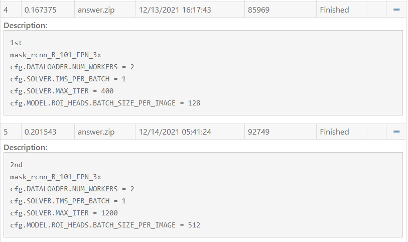
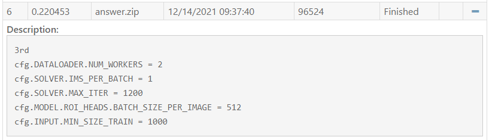
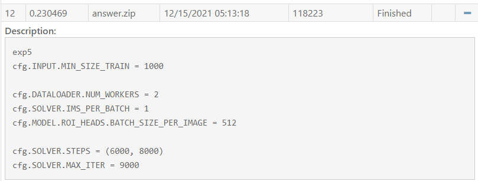
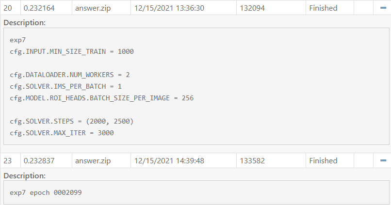
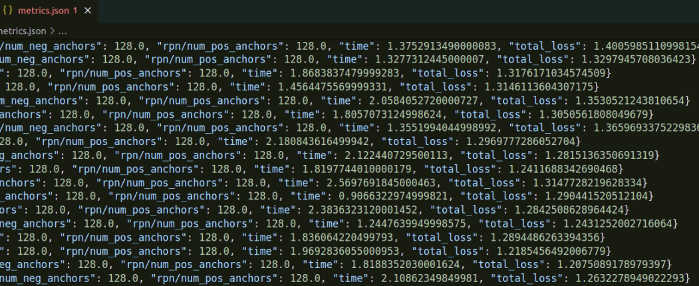
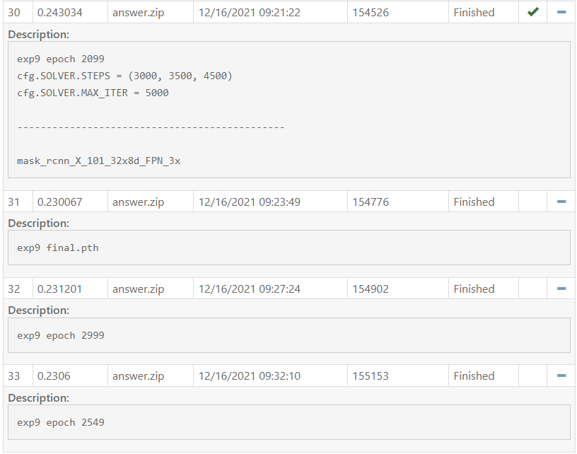

# HW 3
Oscar Lin 309553018  
Project repository: https://github.com/clashroyaleisgood/Course_VRDL/tree/main/HW3_Instance_Segmentation

Competition: https://codalab.lisn.upsaclay.fr/competitions/333?secret_key=3b31d945-289d-4da6-939d-39435b506ee5
___
## Table of Contents

- [HW 3](#hw-3)
	- [Table of Contents](#table-of-contents)
	- [Introduction](#introduction)
		- [Result](#result)
	- [Data Pre-Processing](#data-pre-processing)
	- [Model architecture](#model-architecture)
	- [Hyperparameters](#hyperparameters)
	- [Summary](#summary)

<div style="page-break-after: always;"></div>

## Introduction
This challenge is a Nuclei segmentation task with dataset of 24 training and 6 testing images(1000 x 1000)
The difficulty to this challenge is the image size.
The images are too large to train, especially in segmentation problem which needs a large model architecture.
But the Nuclei are too small compare to original image, result will be bad if I reduce the input size.
So I finally set hyperparameter: IMS_PER_BATCH to 1 to prevent OOM.

### Result
score: **0.24303**  


<div style="page-break-after: always;"></div>

## Data Pre-Processing
In this challenge I only do the label format transform from many 0/1 mask images to RLE form, and place all the information correctly to fit COCO format.  
with help of these websites: 
- https://www.immersivelimit.com/tutorials/create-coco-annotations-from-scratch
- https://www.gushiciku.cn/pl/gavr/zh-tw
- https://www.aiuai.cn/aifarm1578.html

Architecture:
```
train_image_root/
    ├── 1.png
    └── 2.png...
test_image_root/
    ├── 3.png
    └── 4.png...
```
and a config file which describes image paths and masks(RLE form or Polygon)  
https://cocodataset.org/#format-data

<div style="page-break-after: always;"></div>

## Model architecture
I use [Detectron2](https://github.com/facebookresearch/detectron2), which is a platform for object detection, segmentation and other visual recognition tasks, to help me combine the environment and models.
And I use X101-FPN [ResNeXt-101](https://arxiv.org/abs/1611.05431) + FPN in the end which gives me the highest score after many times of training.

## Hyperparameters
```
INPUT.MIN_SIZE_TRAIN = 1000
DATALOADER.NUM_WORKERS = 2
SOLVER.IMS_PER_BATCH = 1
SOLVER.BASE_LR = 0.00025
SOLVER.STEPS = (3000, 3500, 4500)
SOLVER.MAX_ITER = 5000
MODEL.ROI_HEADS.BATCH_SIZE_PER_IMAGE = 256
MODEL.ROI_HEADS.NUM_CLASSES = 1
```

<div style="page-break-after: always;">
Firstly I use R101-FPN to train on this task.

I try to train longer and use larger batch size per image, get a better result.  


Try to restrict the min value of image sizes, get a better result.  


Try to reduce lr at certain steps [6000, 8000] (total: 9000), get a slightly better result.  


Try not to use the final weights to prevent overfitting,  


Checking metric.json to guess the perfect weights by total_loss  


I also try many combinations of hyperparameters, different weights collected at different epoch, the value of predict threshold, ... but not very useful. I'm stuck at behind the baseline a little bit, but always can not over it.  
Finally I use [X101-FPN](https://github.com/facebookresearch/detectron2/blob/main/configs/COCO-InstanceSegmentation/mask_rcnn_X_101_32x8d_FPN_3x.yaml) to train my model with hyperparameters mentioned [before](#hyperparameters) and get best result at epoch 2099.  
After getting this perfect result, I still tried other weights from different epochs, but no one is better than 2099. When I tries to submit the epochs before 2099, system tells me that I met the max submission counts...  


<div style="page-break-after: always;"></div>

## Summary
In this challenge, I use Detectron2 platform and X101-FPN as my instance segmentation model and get score **0.24303** on test data.

During the fine-tuning, I struggle with so many parameters to edit, and many edits looks useless in experiments. It really brought me a lot of Stress. It's really hard to fine-tune a model not only technically but also mentally. Luckily I find a pair that cross the bassline.

<!-- Export to pdf with Typora -->