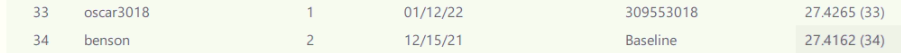
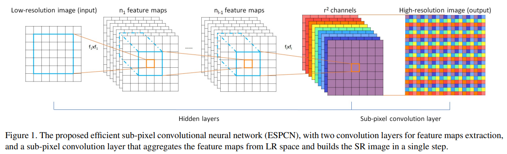

# HW 4
Oscar Lin 309553018  
Project repository: https://github.com/clashroyaleisgood/Course_VRDL/tree/main/HW4_Super_Resolution

Competition: https://codalab.lisn.upsaclay.fr/competitions/622?secret_key=4e06d660-cd84-429c-971b-79d15f78d400

___
## Table of Contents
- [HW 4](#hw-4)
  - [Table of Contents](#table-of-contents)
  - [Introduction](#introduction)
    - [Result](#result)
  - [Model architecture](#model-architecture)
  - [Data Pre-Processing](#data-pre-processing)
  - [Hyper-parameters](#hyper-parameters)
  - [Experiments](#experiments)
    - [Enlarge the cropped image size](#enlarge-the-cropped-image-size)
    - [Smaller the batch size](#smaller-the-batch-size)
  - [Summary](#summary)


## Introduction
This challenge is super resolution which is a famous, useful, and interesting topic in CV region.
We all know that downscale is very simple, just calculating the pixel values,
but it's impossible to recover it(upscale to original size).
Now! with the power of neural network, we try to increase the resolution of the images by
times of convolution layers, by GAN or other methods.

### Result
PSNR: **27.4265**  



<div style="page-break-after: always;"></div>

## Model architecture
I use ESPCN to train my super resolution task.  
[paper](https://arxiv.org/abs/1609.05158)  
[Community github Code](https://github.com/yjn870/ESPCN-pytorch)  



ESPCN is quite concise and fast. It only use few convolution layers to build this model.
Extract features in previous layers, and use a (C * r * r, W, H) feature map to recover the HR image size(C, W * r, H * r) where r is for scale factor, C for channel, W for width, and H for height.

## Data Pre-Processing
Original pytorch code uses 17 as the patch size(cropped HR image size) and 13 as the stride number
(get 17x17 cropped image and then stride 13 pixels to get another 17x17 cropped image and ...)  
This may be too small to images that are larger than 80x80, and other SR models such as [SRGAN](https://github.com/leftthomas/SRGAN)
also uses a larger cropped image size, so I enlarge the cropped image size and the stride to 50 and 15.
This change also gives me a better performance.  

## Hyper-parameters
```
Cropped Size: 50
Stride: 15
Learning Rate: 1e-3
Batch Size: 8
Epochs 300
Optimizer: Adam
```

<div style="page-break-after: always;"></div>

## Experiments

### Enlarge the cropped image size

Large cropped image size leads to a better score.

| Patch Size | validation set PSNR | test image PSNR(google drive score) |
|-|-|-|
| 17 | 29.62 | X |
| 50 | 29.70 | 27.4265 |

with other hyper-parameters: batch size 8, learning rate 1e-3, epoch 300

### Smaller the batch size
Here I found a interesting place that smaller batch size will get a better PSNR score.
This is counterintuitive that we often want to use as large as possible to accelerate the training process
and also let gradient direction more close to global minimum.  
In my opinion, this is because the randomness of the small batch size gradient decent will prevent model from overfitting.  

| Batch Size | validation set PSNR | test image PSNR(google drive score) |
|-|-|-|
| 128 | 29.36 | X |
| 32 | 29.63 | 27.3675 |
| 16 | 29.68 | 27.4135 |
| 8 | 29.70 | **27.4265** |
| 2 (epoch=500) | 29.69 | 27.3994 |

with other hyper-parameters: learning rate 1e-3, epoch 300, patch 50, stride 15
but extreme small size like 2 batch size seems not to work well.

This conclusion is also useful to another strange place: smaller learning rate leads to a worse performance.

| Learning Rate | validation set PSNR | test image PSNR(google drive score) |
|-|-|-|
| 1e-3 | 29.63 | 27.3675 |
| 1e-4 | 29.37 | 27.0596 |

with other hyper-parameters: batch size 32, epoch 300, patch 50, stride 15

<div style="page-break-after: always;"></div>

## Summary
In this challenge, I use ESPCN to get **PSNR:27.4265** on testing data provided by the competition.  
Do lots of experiments to get better result, and thus have some interesting findings such as smaller batch size guide to better result.

<!-- Export to pdf with Typora -->